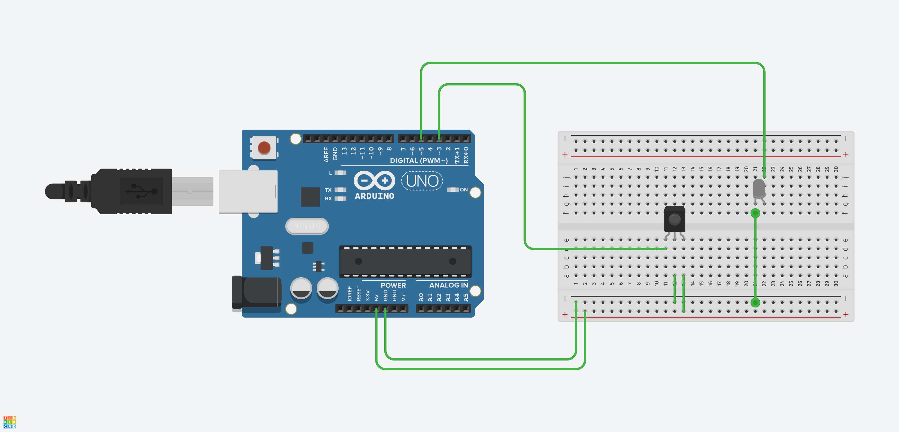

# FeyDelight's Arduino IR Decoder and Blaster 
A simple sketch (that needs a lot of work) that can attempt decode IR signals, blast IR messages, and communicate through a serial port. This project is currently being used in conjunction with [StreamDeck-SerialIRBlaster](https://github.com/feydelight/StreamDeck-SerialIRBlaster)

## Features
1. Hardware capabilities:
    * Serial Communication
    * IR Recieving
    * IR Transmitting
1. Serial capabilities
    * Command `Settings`
        * Change settings of the arduino state machine
        * Possible settings: `DecodeSignals`, `DebugMode`, `ReplyMode`
        * Incoming sample serial message `Settings:true,false,true;`.
            * Will set `DecodeSignals=true`, `DebugMode=false`, `ReplyMode=true`
    * Command `IRCommand`
        * Will transmit IR
        * Possible `Delay`, `Protocol`, `Address`, `Command`
        * Incoming sample serial message `IRCommand:1000,NEC,65282,32;`
1. IR Decoding
    * if `DecodeSignals` is set to true, IR signals picked up by the decoder correctly will get parsed.
    * if `ReplyMode` is also set to true, the message will be transmitted through the serial port.
    * due to the nature of this feature, all IR signals will be processed, so if 
1. IR Transmitting
    * Triggered via the `IRCommand`
    * currently only supports protocol `NEC` (due to lazyness, its all I needed so far)
    
## Circuit Design
The components:
1. Arduino (personally I'm using an Arduino Nano r3, but any board would work)
1. IR Receiver
1. IR LED Emmitor

